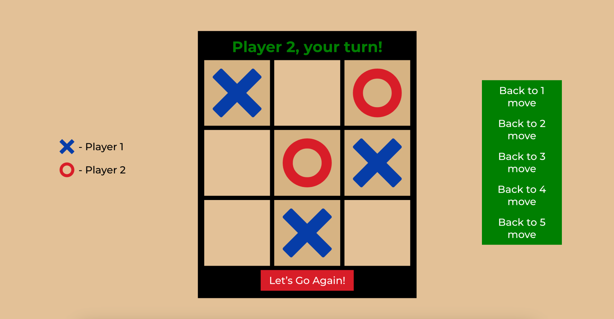

# Крестики-нолики ❌⭕

_Классическая игра на двоих, где игроки по очереди ставят свои символы на игровом поле. Игра завершится, когда один из игроков составит линию из трех своих символов или когда все поля будут заполнены._

## Демо

Играть в игру: [Крестики-нолики](https://mrphysix.github.io/x0/)

## Описание

В этом проекте реализована игра "Крестики-нолики" с использованием React. Игроки могут делать ходы, просматривать историю своих действий и возвращаться к предыдущим шагам. Игра имеет простой и интуитивно понятный интерфейс, который позволяет легко взаимодействовать с игровым полем.

### Основные функции:

- **Игровое поле**: 3x3 сетка, где игроки могут по очереди ставить свои символы (X или O).
- **История ходов**: возможность просматривать предыдущие ходы и возвращаться к ним.
- **Проверка победителя**: игра автоматически определяет победителя или объявляет ничью.
- **Сброс игры**: возможность начать новую игру.
